# Simple server-client database with Python (socket programming)

## Introduction

The following is the code for a small database program based on a server-client relationship with Python. 
The databse contents are provided in the data.txt file and it should follow this specific format; one client per line, and each line contains the client's info as "name | age | address | phone number" where the name is the only mandatory field. If the name field is empty the program will simply ignore that line.
The server is responsible of back-end functions while the client is responsible for the front-end. The server loads the database and it waits for a client to connect. Once a client is connected they will be prompted to select an action to perform on that databse. The server receives the request, it does what the client has requested to do, and sends back an answer to the client. The program loop goes on until either of them disconnects, or until the client exits the program.

## How to run the program:

### Step 1:

Open two terminal windows - one for the server and one for the client - then change the directory to the current working directory. To do that you have to run the "cd" command that stands for "change directory" followed by the path that points to the python files location, then hit enter.

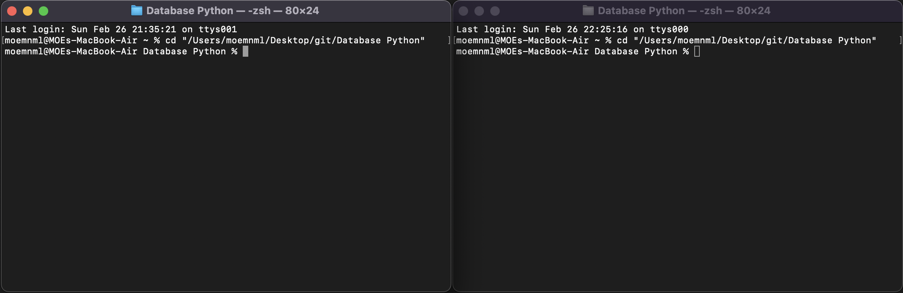

### Step 2:

To run a python program, you should type "python3 filename.py" in the command line and hit enter. That stands for "python3 server.py" in the server terminal and "python3 client.py" in the client terminal, respectiely. NOTE: The server file should be run before the client's.

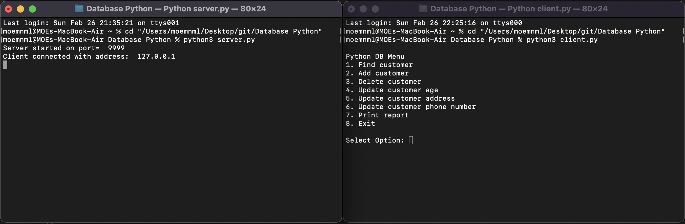

The program is now running!

## What the program does: 

The client is now prompted to select one of the 8 options, and all that needs to be done is to select one of these options and hit enter. 
The terminal on the server side basically serves as a log; it keeps track of the client's requests with a counter, it displays what was requested and the result of the request (succes/failure).
The program checks for wrong inputs such as anything other than numbers from 1 to 8 and will keep requesting input until the client responds with a correct one.

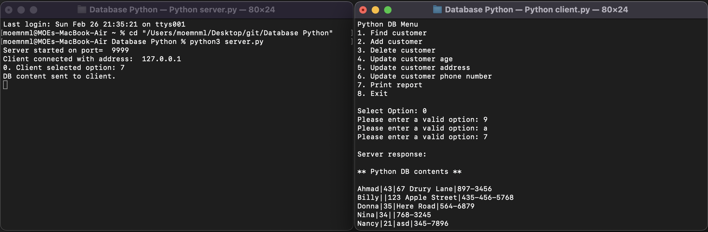

### Option 7: Print report

This is the most important function as the server sends the database contents and displays them to the client's interface. It allows the client to see the contents of the database as well as to check if the the modifications that the client did to it were applied.

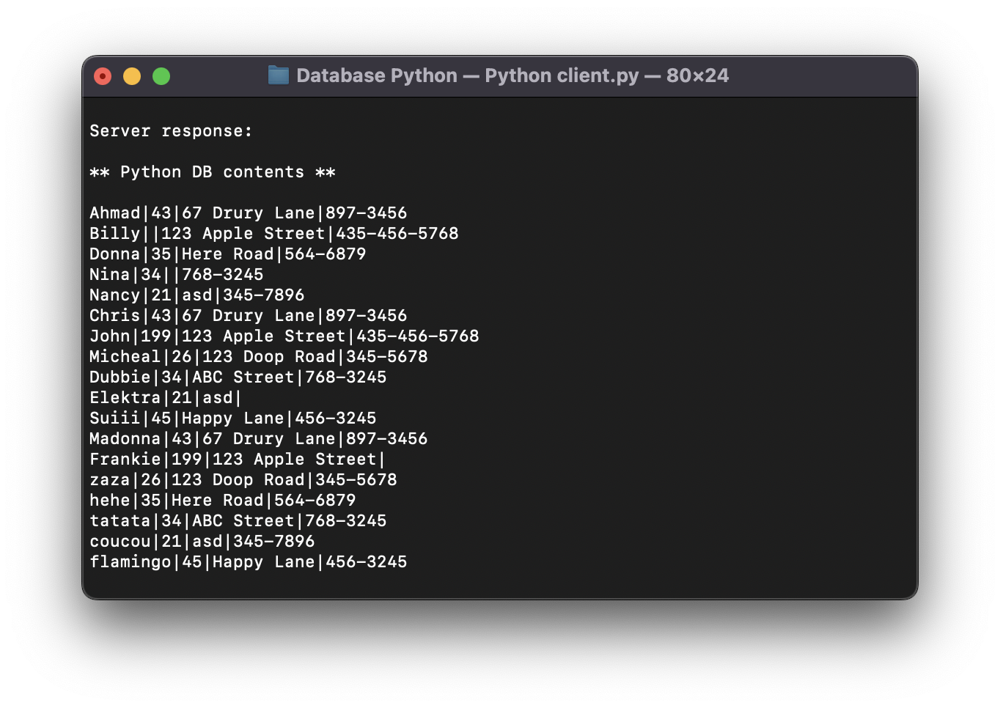

### Option 1: Find client by name

Prompt the user for a name and then send the name to the server. The server will respond to the client either with the full customer record or a “customer not found” message. Note that this message MUST be sent back to the client which will then display it.
The program won't allow to seach for an empty string, it will prompt the user to input again, and note that it is case sensitive.

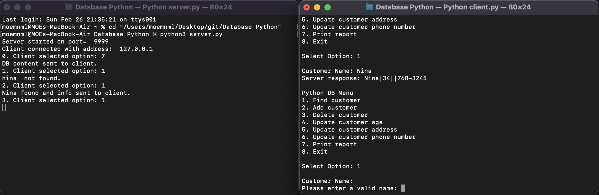

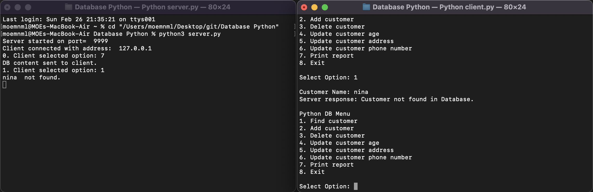

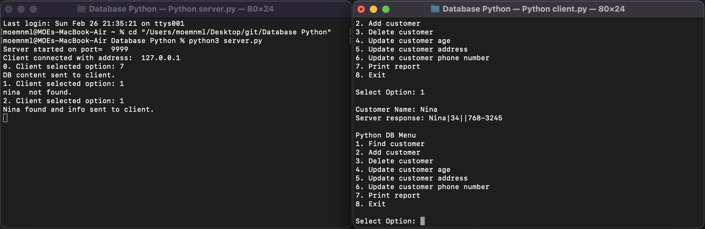

### Option 2: Add customer

The client will prompt the user to enter each of the four fields. These will be sent to the server and the server will respond with either a “Customer already exists” message or a confirmation message that the customer has been added.
The program won't allow to input an empty name, or an age that is not a number.
Once added, the database will be updated (you can check the updated databse by running 7 the print report option).

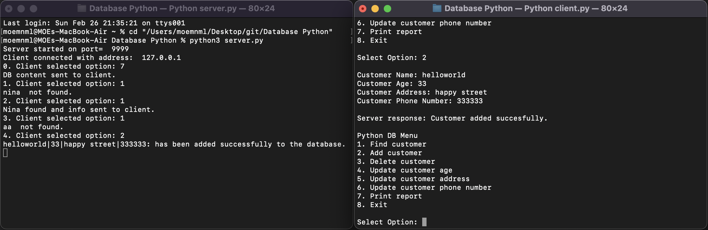

### Option 3: Delete customer 

Delete the specified customer. The server will respond with either a “Customer does not exist” message or a confirmation message.
The program won't allow to input an empty name, or an age that is not a number.

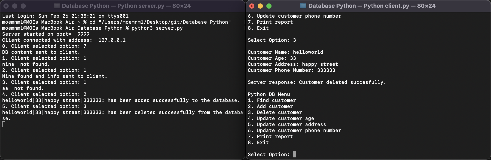

### Options 4, 5 and 6: Update customer info

All update options will prompt for a name, then for the field to be updated. The server will respond either with a “Customer not found” message or a confirmation message.
The program won't allow to input an empty name, or an age that is not a number.
Once updated, the database will be updated (you can check the updated databse by running 7 the print report option).

Before update on line 1 of the databse in data.txt: Ahmad|43|67 Drury Lane|897-3456

After the update:

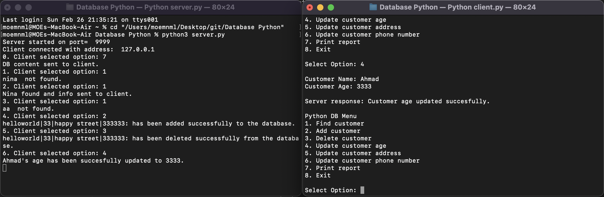

Checking with option 7:

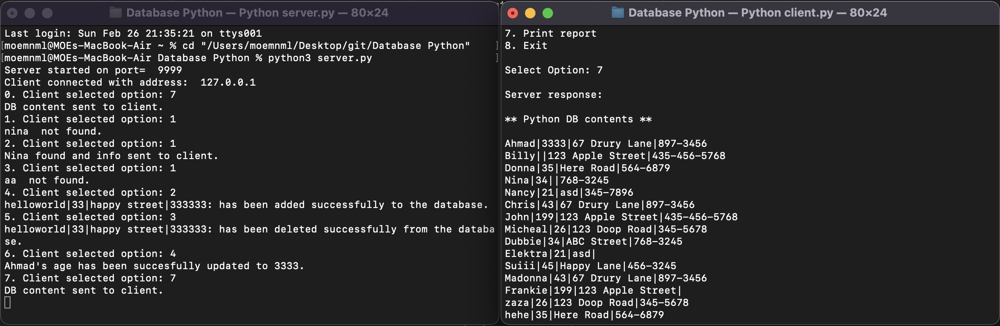

### Options 8: Exit

It should print a “Good bye” message and simply terminate the client and the server application. The server application must in fact keep running even after the client exits, but that was done in the sake of terminating the whole program.

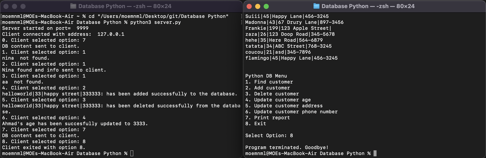

Feel free to pull the code and edit it/suggest edits as you wish. 
The end :)